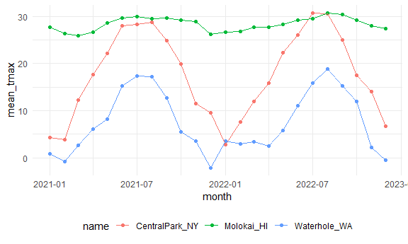
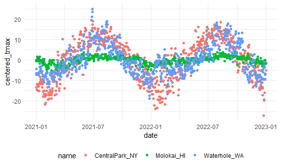

viz3
================
Sarahy Martinez
2024-10-03

## Load the weather data

``` r
weather_df = 
  rnoaa::meteo_pull_monitors(
    c("USW00094728", "USW00022534", "USS0023B17S"),
    var = c("PRCP", "TMIN", "TMAX"), 
    date_min = "2021-01-01",
    date_max = "2022-12-31") %>% 
  mutate(
    name = case_match(
      id, 
      "USW00094728" ~ "CentralPark_NY", 
      "USW00022534" ~ "Molokai_HI",
      "USS0023B17S" ~ "Waterhole_WA"),
    tmin = tmin / 10,
    tmax = tmax / 10,
    month = lubridate::floor_date(date, unit = "month")) %>%   #extract the month variable, lubridate package tidyverse adjacent says to get the floor of a date aned sort of round whatever date or pull the dates donwn to the nearest. month is rounded down
  select(name, id, everything())
```

    ## using cached file: C:\Users\sarah\AppData\Local/R/cache/R/rnoaa/noaa_ghcnd/USW00094728.dly

    ## date created (size, mb): 2024-09-26 23:39:45.766142 (8.668)

    ## file min/max dates: 1869-01-01 / 2024-09-30

    ## using cached file: C:\Users\sarah\AppData\Local/R/cache/R/rnoaa/noaa_ghcnd/USW00022534.dly

    ## date created (size, mb): 2024-09-26 23:40:09.008997 (3.94)

    ## file min/max dates: 1949-10-01 / 2024-09-30

    ## using cached file: C:\Users\sarah\AppData\Local/R/cache/R/rnoaa/noaa_ghcnd/USS0023B17S.dly

    ## date created (size, mb): 2024-09-26 23:40:17.640862 (1.038)

    ## file min/max dates: 1999-09-01 / 2024-09-30

``` r
weather_df
```

    ## # A tibble: 2,190 × 7
    ##    name           id          date        prcp  tmax  tmin month     
    ##    <chr>          <chr>       <date>     <dbl> <dbl> <dbl> <date>    
    ##  1 CentralPark_NY USW00094728 2021-01-01   157   4.4   0.6 2021-01-01
    ##  2 CentralPark_NY USW00094728 2021-01-02    13  10.6   2.2 2021-01-01
    ##  3 CentralPark_NY USW00094728 2021-01-03    56   3.3   1.1 2021-01-01
    ##  4 CentralPark_NY USW00094728 2021-01-04     5   6.1   1.7 2021-01-01
    ##  5 CentralPark_NY USW00094728 2021-01-05     0   5.6   2.2 2021-01-01
    ##  6 CentralPark_NY USW00094728 2021-01-06     0   5     1.1 2021-01-01
    ##  7 CentralPark_NY USW00094728 2021-01-07     0   5    -1   2021-01-01
    ##  8 CentralPark_NY USW00094728 2021-01-08     0   2.8  -2.7 2021-01-01
    ##  9 CentralPark_NY USW00094728 2021-01-09     0   2.8  -4.3 2021-01-01
    ## 10 CentralPark_NY USW00094728 2021-01-10     0   5    -1.6 2021-01-01
    ## # ℹ 2,180 more rows

## `group_by`

``` r
weather_df %>% 
  group_by(name) #appears like nothing happened by whats different says groups name[3]
```

    ## # A tibble: 2,190 × 7
    ## # Groups:   name [3]
    ##    name           id          date        prcp  tmax  tmin month     
    ##    <chr>          <chr>       <date>     <dbl> <dbl> <dbl> <date>    
    ##  1 CentralPark_NY USW00094728 2021-01-01   157   4.4   0.6 2021-01-01
    ##  2 CentralPark_NY USW00094728 2021-01-02    13  10.6   2.2 2021-01-01
    ##  3 CentralPark_NY USW00094728 2021-01-03    56   3.3   1.1 2021-01-01
    ##  4 CentralPark_NY USW00094728 2021-01-04     5   6.1   1.7 2021-01-01
    ##  5 CentralPark_NY USW00094728 2021-01-05     0   5.6   2.2 2021-01-01
    ##  6 CentralPark_NY USW00094728 2021-01-06     0   5     1.1 2021-01-01
    ##  7 CentralPark_NY USW00094728 2021-01-07     0   5    -1   2021-01-01
    ##  8 CentralPark_NY USW00094728 2021-01-08     0   2.8  -2.7 2021-01-01
    ##  9 CentralPark_NY USW00094728 2021-01-09     0   2.8  -4.3 2021-01-01
    ## 10 CentralPark_NY USW00094728 2021-01-10     0   5    -1.6 2021-01-01
    ## # ℹ 2,180 more rows

``` r
weather_df %>% 
  group_by(name, month) %>% #groups by name and month
  ungroup() #gets rid of whatever grouping structure you have 
```

    ## # A tibble: 2,190 × 7
    ##    name           id          date        prcp  tmax  tmin month     
    ##    <chr>          <chr>       <date>     <dbl> <dbl> <dbl> <date>    
    ##  1 CentralPark_NY USW00094728 2021-01-01   157   4.4   0.6 2021-01-01
    ##  2 CentralPark_NY USW00094728 2021-01-02    13  10.6   2.2 2021-01-01
    ##  3 CentralPark_NY USW00094728 2021-01-03    56   3.3   1.1 2021-01-01
    ##  4 CentralPark_NY USW00094728 2021-01-04     5   6.1   1.7 2021-01-01
    ##  5 CentralPark_NY USW00094728 2021-01-05     0   5.6   2.2 2021-01-01
    ##  6 CentralPark_NY USW00094728 2021-01-06     0   5     1.1 2021-01-01
    ##  7 CentralPark_NY USW00094728 2021-01-07     0   5    -1   2021-01-01
    ##  8 CentralPark_NY USW00094728 2021-01-08     0   2.8  -2.7 2021-01-01
    ##  9 CentralPark_NY USW00094728 2021-01-09     0   2.8  -4.3 2021-01-01
    ## 10 CentralPark_NY USW00094728 2021-01-10     0   5    -1.6 2021-01-01
    ## # ℹ 2,180 more rows

## counting the things

ie. how many ovbservations exist count months in this code

``` r
weather_df %>% 
  group_by(month) %>% 
  summarize(n_obs = n())   #n() counts for you, n_obs is the variable you created and end result is a tibble 
```

    ## # A tibble: 24 × 2
    ##    month      n_obs
    ##    <date>     <int>
    ##  1 2021-01-01    93
    ##  2 2021-02-01    84
    ##  3 2021-03-01    93
    ##  4 2021-04-01    90
    ##  5 2021-05-01    93
    ##  6 2021-06-01    90
    ##  7 2021-07-01    93
    ##  8 2021-08-01    93
    ##  9 2021-09-01    90
    ## 10 2021-10-01    93
    ## # ℹ 14 more rows

we can also use count()

``` r
weather_df %>% 
  count(month, name = "n_obs")
```

    ## # A tibble: 24 × 2
    ##    month      n_obs
    ##    <date>     <int>
    ##  1 2021-01-01    93
    ##  2 2021-02-01    84
    ##  3 2021-03-01    93
    ##  4 2021-04-01    90
    ##  5 2021-05-01    93
    ##  6 2021-06-01    90
    ##  7 2021-07-01    93
    ##  8 2021-08-01    93
    ##  9 2021-09-01    90
    ## 10 2021-10-01    93
    ## # ℹ 14 more rows

**NEVER** use base R’s `table`

``` r
  weather_df %>% 
  pull(month) %>% 
  table()  #painful to look at because the result isnt a dataframe, to get to the table function 
```

other helpful counters

``` r
weather_df %>% 
  group_by(month) %>% 
  summarize(
    n_obs = n(),
    n_days = n_distinct(date) #n_distint looks at this month how many dated are distinct 
  )
```

    ## # A tibble: 24 × 3
    ##    month      n_obs n_days
    ##    <date>     <int>  <int>
    ##  1 2021-01-01    93     31
    ##  2 2021-02-01    84     28
    ##  3 2021-03-01    93     31
    ##  4 2021-04-01    90     30
    ##  5 2021-05-01    93     31
    ##  6 2021-06-01    90     30
    ##  7 2021-07-01    93     31
    ##  8 2021-08-01    93     31
    ##  9 2021-09-01    90     30
    ## 10 2021-10-01    93     31
    ## # ℹ 14 more rows

## A digression on 2x2 tables

``` r
weather_df %>% 
  filter(name!= "Molokai_HI") %>% 
  mutate(
    cold = case_when(
      tmax< 5~ "cold",
      tmax >= 5 ~ "not_cold",  # ~ if this is true 
      TRUE ~ ""
    )
  ) %>% 
  group_by(name, cold) %>% 
  summarize( count = n())   #2x2 but not helpful, can also do a pivot wider but below is better
```

    ## `summarise()` has grouped output by 'name'. You can override using the
    ## `.groups` argument.

    ## # A tibble: 5 × 3
    ## # Groups:   name [2]
    ##   name           cold       count
    ##   <chr>          <chr>      <int>
    ## 1 CentralPark_NY "cold"        96
    ## 2 CentralPark_NY "not_cold"   634
    ## 3 Waterhole_WA   ""            16
    ## 4 Waterhole_WA   "cold"       319
    ## 5 Waterhole_WA   "not_cold"   395

``` r
weather_df %>%  
  mutate(cold = case_when(
    tmax <  5 ~ "cold",
    tmax >= 5 ~ "not_cold",
    TRUE     ~ ""
  )) %>% 
  filter(name != "Molokai_HI") %>%  
  janitor::tabyl(name, cold)            #this structure is better for 2x2
```

    ##            name cold not_cold emptystring_
    ##  CentralPark_NY   96      634            0
    ##    Waterhole_WA  319      395           16

## General Summarries

You can do lots of summaries

``` r
weather_df %>% 
  group_by(month) %>% 
  summarize(
    mean_tmax = mean(tmax, na.rm = TRUE), #na.rm removes the missing variables
    mean_prcp = mean(prcp, na.rm = TRUE),
    median_tmin = median(tmin, na.rm = TRUE)
     )
```

    ## # A tibble: 24 × 4
    ##    month      mean_tmax mean_prcp median_tmin
    ##    <date>         <dbl>     <dbl>       <dbl>
    ##  1 2021-01-01     10.9       39.5        0.6 
    ##  2 2021-02-01      9.82      42.6       -1.65
    ##  3 2021-03-01     13.7       55.5        5   
    ##  4 2021-04-01     16.8       14.7        8.05
    ##  5 2021-05-01     19.6       17.3       11.1 
    ##  6 2021-06-01     24.3       14.1       17.8 
    ##  7 2021-07-01     25.2       30.7       21.1 
    ##  8 2021-08-01     25.2       30.6       21.1 
    ##  9 2021-09-01     22.4       35.4       17.5 
    ## 10 2021-10-01     18.2       36.0       13.9 
    ## # ℹ 14 more rows

This is a dataframe! SO we can make a plot

``` r
weather_df %>% 
  group_by(name,month) %>% 
  summarize(
    mean_tmax = mean(tmax, na.rm = TRUE), #na.rm removes the missing variables
    mean_prcp = mean(prcp, na.rm = TRUE),
    median_tmin = median(tmin, na.rm = TRUE)
     ) %>% 
  ggplot(aes( x= month, y=mean_tmax, color = name))+ 
  geom_point() +
  geom_line()
```

    ## `summarise()` has grouped output by 'name'. You can override using the
    ## `.groups` argument.



Suppose you want to summarize many columns.

``` r
weather_df %>% 
  group_by(name, month) %>% 
  summarize(across(prcp: tmin, mean)) #can list a range and use across for each of these columns use this summary
```

    ## `summarise()` has grouped output by 'name'. You can override using the
    ## `.groups` argument.

    ## # A tibble: 72 × 5
    ## # Groups:   name [3]
    ##    name           month       prcp  tmax  tmin
    ##    <chr>          <date>     <dbl> <dbl> <dbl>
    ##  1 CentralPark_NY 2021-01-01  18.9  4.27 -1.15
    ##  2 CentralPark_NY 2021-02-01  46.6  3.87 -1.39
    ##  3 CentralPark_NY 2021-03-01  28.0 12.3   3.1 
    ##  4 CentralPark_NY 2021-04-01  22.8 17.6   7.48
    ##  5 CentralPark_NY 2021-05-01  35.7 22.1  12.2 
    ##  6 CentralPark_NY 2021-06-01  22.2 28.1  18.9 
    ##  7 CentralPark_NY 2021-07-01  90.9 28.4  20.6 
    ##  8 CentralPark_NY 2021-08-01  84.5 28.8  21.8 
    ##  9 CentralPark_NY 2021-09-01  84.9 24.8  17.8 
    ## 10 CentralPark_NY 2021-10-01  43.1 19.9  13.4 
    ## # ℹ 62 more rows

Reminder: sometimes your results are easier to read in another format ,

``` r
weather_df %>% 
  group_by(name, month) %>% 
  summarize(mean_tmax = mean(tmax)) %>% 
  pivot_wider(
    names_from= name,
    values_from = mean_tmax
  )%>% 
# the names came from names, values came from tmax, and row name is whatever is left in your dataset (using pivot wider)
  knitr::kable(digits =1)  #formats r markdown and allows to print nicer
```

    ## `summarise()` has grouped output by 'name'. You can override using the
    ## `.groups` argument.

| month      | CentralPark_NY | Molokai_HI | Waterhole_WA |
|:-----------|---------------:|-----------:|-------------:|
| 2021-01-01 |            4.3 |       27.6 |          0.8 |
| 2021-02-01 |            3.9 |       26.4 |         -0.8 |
| 2021-03-01 |           12.3 |       25.9 |           NA |
| 2021-04-01 |           17.6 |       26.6 |          6.1 |
| 2021-05-01 |           22.1 |       28.6 |          8.2 |
| 2021-06-01 |           28.1 |       29.6 |         15.3 |
| 2021-07-01 |           28.4 |       30.0 |         17.3 |
| 2021-08-01 |           28.8 |       29.5 |         17.2 |
| 2021-09-01 |           24.8 |       29.7 |         12.6 |
| 2021-10-01 |           19.9 |       29.1 |          5.5 |
| 2021-11-01 |           11.5 |       28.8 |          3.5 |
| 2021-12-01 |            9.6 |       26.2 |           NA |
| 2022-01-01 |            2.9 |       26.6 |          3.6 |
| 2022-02-01 |            7.7 |       26.8 |           NA |
| 2022-03-01 |           12.0 |       27.7 |          3.4 |
| 2022-04-01 |           15.8 |       27.7 |          2.5 |
| 2022-05-01 |           22.3 |         NA |          5.8 |
| 2022-06-01 |           26.1 |       29.2 |         11.1 |
| 2022-07-01 |           30.7 |       29.5 |         15.9 |
| 2022-08-01 |           30.5 |       30.7 |           NA |
| 2022-09-01 |           24.9 |       30.4 |         15.2 |
| 2022-10-01 |           17.4 |       29.2 |         11.9 |
| 2022-11-01 |           14.0 |       28.0 |          2.1 |
| 2022-12-01 |            6.8 |       27.3 |           NA |

Now, another funcion affected by group_by is mutate

## `group_by` and `mutate`

if you forget that you grouped can get into trouble

``` r
weather_df %>% 
  group_by(name) %>% 
  mutate(
    mean_tmax = mean(tmax, na.rm = TRUE), #GROUPING when you do a mutate it will compute some observation and define a new variable according to this group first and then and this group etc. Why care because we might want to center to remove vertical distance.
 centered_tmax = tmax - mean_tmax  # we didn't subtract same mean from everyone just waikiki from waikiki etc. 
     ) %>% 
  ggplot(aes(x=date, y = centered_tmax, color=name))+
  geom_point()
```

    ## Warning: Removed 17 rows containing missing values or values outside the scale range
    ## (`geom_point()`).



about window functions

so in the example above we took the mean and it took every t_max value
observation and based on this tmax it then plugged in that for each row
in our dataset.

In windown functions you put in 365 values and it spits out 365 values
and these might be different values.

ranking …

``` r
weather_df %>% 
  group_by(name, month) %>%  #group first
  mutate(
    temp_rank = min_rank(tmax)) %>%   #we want to define a ranking according to the min_ rank tmax, temp rank we put the tmax values and says its the 22nd and 12 lowest values then the 5, 4th, 3 coldest days in the month. then filter for coldest day in each month. 
  filter(temp_rank == 1) # spits out rank 
```

    ## # A tibble: 92 × 8
    ## # Groups:   name, month [72]
    ##    name           id          date        prcp  tmax  tmin month      temp_rank
    ##    <chr>          <chr>       <date>     <dbl> <dbl> <dbl> <date>         <int>
    ##  1 CentralPark_NY USW00094728 2021-01-29     0  -3.8  -9.9 2021-01-01         1
    ##  2 CentralPark_NY USW00094728 2021-02-08     0  -1.6  -8.2 2021-02-01         1
    ##  3 CentralPark_NY USW00094728 2021-03-02     0   0.6  -6   2021-03-01         1
    ##  4 CentralPark_NY USW00094728 2021-04-02     0   3.9  -2.1 2021-04-01         1
    ##  5 CentralPark_NY USW00094728 2021-05-29   117  10.6   8.3 2021-05-01         1
    ##  6 CentralPark_NY USW00094728 2021-05-30   226  10.6   8.3 2021-05-01         1
    ##  7 CentralPark_NY USW00094728 2021-06-11     0  20.6  16.7 2021-06-01         1
    ##  8 CentralPark_NY USW00094728 2021-06-12     0  20.6  16.7 2021-06-01         1
    ##  9 CentralPark_NY USW00094728 2021-07-03    86  18.9  15   2021-07-01         1
    ## 10 CentralPark_NY USW00094728 2021-08-04     0  24.4  19.4 2021-08-01         1
    ## # ℹ 82 more rows

``` r
#opposite order
weather_df %>% 
  group_by(name, month) %>%  #group first
  mutate(temp_rank = min_rank(desc(tmax)))
```

    ## # A tibble: 2,190 × 8
    ## # Groups:   name, month [72]
    ##    name           id          date        prcp  tmax  tmin month      temp_rank
    ##    <chr>          <chr>       <date>     <dbl> <dbl> <dbl> <date>         <int>
    ##  1 CentralPark_NY USW00094728 2021-01-01   157   4.4   0.6 2021-01-01        17
    ##  2 CentralPark_NY USW00094728 2021-01-02    13  10.6   2.2 2021-01-01         1
    ##  3 CentralPark_NY USW00094728 2021-01-03    56   3.3   1.1 2021-01-01        19
    ##  4 CentralPark_NY USW00094728 2021-01-04     5   6.1   1.7 2021-01-01         9
    ##  5 CentralPark_NY USW00094728 2021-01-05     0   5.6   2.2 2021-01-01        13
    ##  6 CentralPark_NY USW00094728 2021-01-06     0   5     1.1 2021-01-01        14
    ##  7 CentralPark_NY USW00094728 2021-01-07     0   5    -1   2021-01-01        14
    ##  8 CentralPark_NY USW00094728 2021-01-08     0   2.8  -2.7 2021-01-01        20
    ##  9 CentralPark_NY USW00094728 2021-01-09     0   2.8  -4.3 2021-01-01        20
    ## 10 CentralPark_NY USW00094728 2021-01-10     0   5    -1.6 2021-01-01        14
    ## # ℹ 2,180 more rows

Can we take all of these oberservation, shift them and then drop them
down.

``` r
weather_df %>% 
  group_by(name) %>%  #group first
  mutate(lag_temp = lag(tmax,5))
```

    ## # A tibble: 2,190 × 8
    ## # Groups:   name [3]
    ##    name           id          date        prcp  tmax  tmin month      lag_temp
    ##    <chr>          <chr>       <date>     <dbl> <dbl> <dbl> <date>        <dbl>
    ##  1 CentralPark_NY USW00094728 2021-01-01   157   4.4   0.6 2021-01-01     NA  
    ##  2 CentralPark_NY USW00094728 2021-01-02    13  10.6   2.2 2021-01-01     NA  
    ##  3 CentralPark_NY USW00094728 2021-01-03    56   3.3   1.1 2021-01-01     NA  
    ##  4 CentralPark_NY USW00094728 2021-01-04     5   6.1   1.7 2021-01-01     NA  
    ##  5 CentralPark_NY USW00094728 2021-01-05     0   5.6   2.2 2021-01-01     NA  
    ##  6 CentralPark_NY USW00094728 2021-01-06     0   5     1.1 2021-01-01      4.4
    ##  7 CentralPark_NY USW00094728 2021-01-07     0   5    -1   2021-01-01     10.6
    ##  8 CentralPark_NY USW00094728 2021-01-08     0   2.8  -2.7 2021-01-01      3.3
    ##  9 CentralPark_NY USW00094728 2021-01-09     0   2.8  -4.3 2021-01-01      6.1
    ## 10 CentralPark_NY USW00094728 2021-01-10     0   5    -1.6 2021-01-01      5.6
    ## # ℹ 2,180 more rows

``` r
#if you wanna compute changes from this day or this, or does yesterdays temp predict today 


weather_df %>% 
  group_by(name) %>%  
  mutate(temp_change = tmax - lag(tmax)) %>%  # we can also compute summaries
summarize(
  temp_change_max = max(temp_change, na.rm = TRUE),
   temp_change_sd = sd(temp_change, na.rm = TRUE)
)
```

    ## # A tibble: 3 × 3
    ##   name           temp_change_max temp_change_sd
    ##   <chr>                    <dbl>          <dbl>
    ## 1 CentralPark_NY            12.2           4.43
    ## 2 Molokai_HI                 5.6           1.24
    ## 3 Waterhole_WA              11.1           3.04

Helpful because for example can you please compute the the day to day
temperature variability, the day to day standard deviations and
temperatures for each group. It has already been done above. We are
answering a relatively complex question in a short amount of code.

## Quick Note

summarize only gets you so far. If we want to for example take the
weather data frame and ask what is the regression coefficient regressing
and group by name and month. Its a hard problem and how do you do that
regression. Wont take you quite where you want but the group by and
summarize gets you pretty far.
