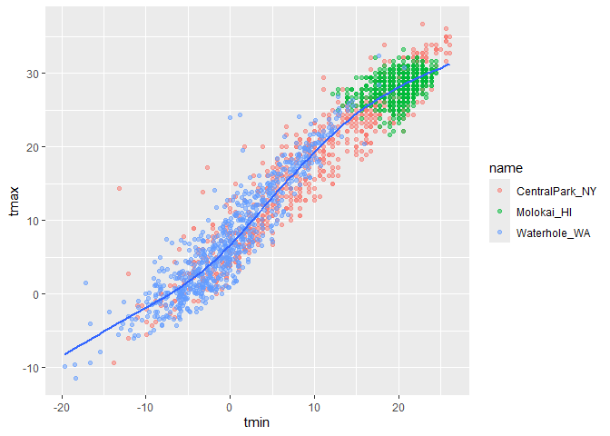
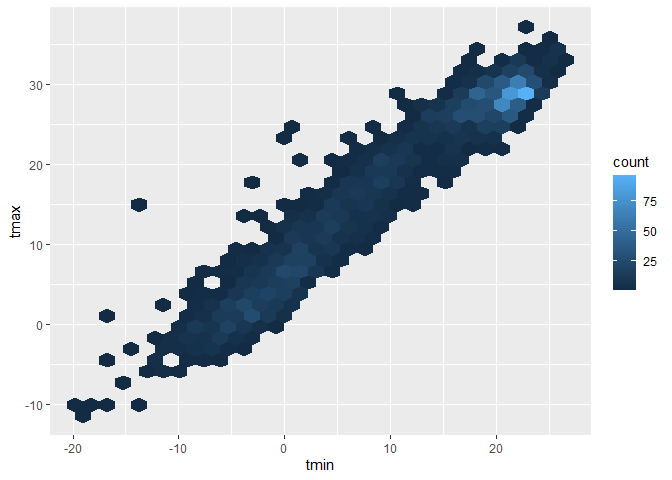
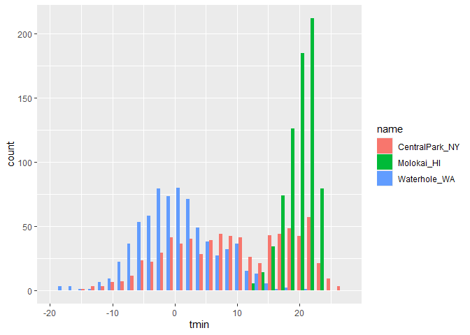
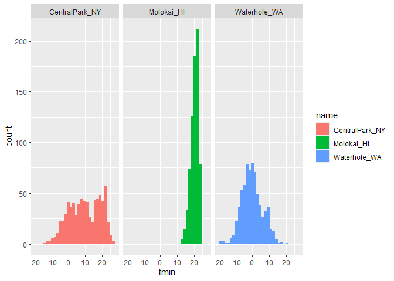
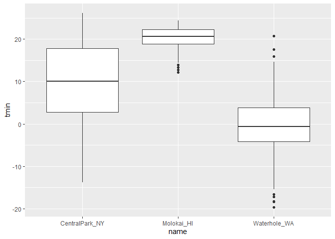

viz_i
================
Sarahy Martinez
2024-09-27

``` r
library(tidyverse)
```

    ## ── Attaching core tidyverse packages ──────────────────────── tidyverse 2.0.0 ──
    ## ✔ dplyr     1.1.4     ✔ readr     2.1.5
    ## ✔ forcats   1.0.0     ✔ stringr   1.5.1
    ## ✔ ggplot2   3.5.1     ✔ tibble    3.2.1
    ## ✔ lubridate 1.9.3     ✔ tidyr     1.3.1
    ## ✔ purrr     1.0.2     
    ## ── Conflicts ────────────────────────────────────────── tidyverse_conflicts() ──
    ## ✖ dplyr::filter() masks stats::filter()
    ## ✖ dplyr::lag()    masks stats::lag()
    ## ℹ Use the conflicted package (<http://conflicted.r-lib.org/>) to force all conflicts to become errors

``` r
library(ggridges)
library(hexbin)
```

# Load the Weather data

We’ll be working with NOAA weather data, which is downloaded using
rnoaa::meteo_pull_monitors function in the code chunk below; similar
code underlies the weather dataset used elsewhere in the course. Because
this process can take some time, I’ll cache the code chunk. - create
data frame not imported from reader instead rnoaa:: meteo_pull , the
rnoa allows to access aggregated public service data, using it as a
portal and telling I want data from these station and the min and max
temps. then start date and final date. code goes online and says bring
me this data. then name= to rename the weather stations. the tmin =
tmin/10 bc temps from rnoa are 10th of degree celcuis and end with full
degree max.then just relocate.

``` r
weather_df = 
  rnoaa::meteo_pull_monitors(
    c("USW00094728", "USW00022534", "USS0023B17S"),
    var = c("PRCP", "TMIN", "TMAX"), 
    date_min = "2021-01-01",
    date_max = "2022-12-31") |>
  mutate(
    name = case_match(
      id, 
      "USW00094728" ~ "CentralPark_NY", 
      "USW00022534" ~ "Molokai_HI",
      "USS0023B17S" ~ "Waterhole_WA"),
    tmin = tmin / 10,
    tmax = tmax / 10) |>
  select(name, id, everything())
```

    ## using cached file: C:\Users\sarah\AppData\Local/R/cache/R/rnoaa/noaa_ghcnd/USW00094728.dly

    ## date created (size, mb): 2024-09-26 23:39:45.766142 (8.668)

    ## file min/max dates: 1869-01-01 / 2024-09-30

    ## using cached file: C:\Users\sarah\AppData\Local/R/cache/R/rnoaa/noaa_ghcnd/USW00022534.dly

    ## date created (size, mb): 2024-09-26 23:40:09.008997 (3.94)

    ## file min/max dates: 1949-10-01 / 2024-09-30

    ## using cached file: C:\Users\sarah\AppData\Local/R/cache/R/rnoaa/noaa_ghcnd/USS0023B17S.dly

    ## date created (size, mb): 2024-09-26 23:40:17.640862 (1.038)

    ## file min/max dates: 1999-09-01 / 2024-09-30

``` r
weather_df
```

    ## # A tibble: 2,190 × 6
    ##    name           id          date        prcp  tmax  tmin
    ##    <chr>          <chr>       <date>     <dbl> <dbl> <dbl>
    ##  1 CentralPark_NY USW00094728 2021-01-01   157   4.4   0.6
    ##  2 CentralPark_NY USW00094728 2021-01-02    13  10.6   2.2
    ##  3 CentralPark_NY USW00094728 2021-01-03    56   3.3   1.1
    ##  4 CentralPark_NY USW00094728 2021-01-04     5   6.1   1.7
    ##  5 CentralPark_NY USW00094728 2021-01-05     0   5.6   2.2
    ##  6 CentralPark_NY USW00094728 2021-01-06     0   5     1.1
    ##  7 CentralPark_NY USW00094728 2021-01-07     0   5    -1  
    ##  8 CentralPark_NY USW00094728 2021-01-08     0   2.8  -2.7
    ##  9 CentralPark_NY USW00094728 2021-01-09     0   2.8  -4.3
    ## 10 CentralPark_NY USW00094728 2021-01-10     0   5    -1.6
    ## # ℹ 2,180 more rows

As always, I start by looking at the data; below I’m showing the result
of printing the dataframe in the console, but would also use
view(weather_df) to look around a bit.

\#Scatterplots!

Create my first scatterplot ever.

``` r
ggplot(weather_df, aes(x = tmin, y = tmax )) + 
  geom_point()
```

    ## Warning: Removed 17 rows containing missing values or values outside the scale range
    ## (`geom_point()`).

<!-- -->

New approach, same plot.

``` r
#good way because can also data manipulate 
weather_df %>% 
  ggplot(aes(x = tmin, y= tmax))+
  geom_point()
```

    ## Warning: Removed 17 rows containing missing values or values outside the scale range
    ## (`geom_point()`).

<!-- -->

Save and edit plot object

``` r
weather_plot = 
  weather_df %>% 
  ggplot(aes(x= tmin, y = tmax))   #plot created and saved

weather_plot  #now its saved and we can change it later on, can also print it.
```

<!-- -->

## Advanced Scatter Plot

``` r
  weather_df %>% 
  ggplot(aes(x= tmin, y = tmax, color= name))+ geom_point() #adding aes,
```

    ## Warning: Removed 17 rows containing missing values or values outside the scale range
    ## (`geom_point()`).

<!-- -->

Adding new geometry, to give line that goes through, geom_smooth and add
ste= false

``` r
  weather_df %>% 
  ggplot(aes(x= tmin, y = tmax, color= name)) +
  geom_point()+
  geom_smooth(se = FALSE)
```

    ## `geom_smooth()` using method = 'loess' and formula = 'y ~ x'

    ## Warning: Removed 17 rows containing non-finite outside the scale range
    ## (`stat_smooth()`).

    ## Warning: Removed 17 rows containing missing values or values outside the scale range
    ## (`geom_point()`).

<!-- -->

What about the aes placement? we specified inside teh ggplot but we can
also do it in geom_point

``` r
  weather_df %>% 
  ggplot(aes(x= tmin, y = tmax)) +
  geom_point(aes(color= name))
```

    ## Warning: Removed 17 rows containing missing values or values outside the scale range
    ## (`geom_point()`).

<!-- -->

``` r
# not much of a difference but it will start once we add geom_smooth 
```

``` r
 weather_df %>% 
  ggplot(aes(x= tmin, y = tmax)) +
  geom_point(aes(color= name))
```

    ## Warning: Removed 17 rows containing missing values or values outside the scale range
    ## (`geom_point()`).

<!-- -->

``` r
  geom_smooth()
```

    ## geom_smooth: na.rm = FALSE, orientation = NA, se = TRUE
    ## stat_smooth: na.rm = FALSE, orientation = NA, se = TRUE
    ## position_identity

``` r
  #color only applied to the scatter plot, we can define aes in ggplot and geom
  ggplot(weather_df, aes(x = tmin, y = tmax)) + 
  geom_point(aes(color = name), alpha = .5) +
  geom_smooth(se = FALSE)
```

    ## `geom_smooth()` using method = 'gam' and formula = 'y ~ s(x, bs = "cs")'

    ## Warning: Removed 17 rows containing non-finite outside the scale range
    ## (`stat_smooth()`).
    ## Removed 17 rows containing missing values or values outside the scale range
    ## (`geom_point()`).

<!-- -->

Lets facet some things!

``` r
 weather_df %>% 
  ggplot(aes(x= tmin, y = tmax, color= name)) +
  geom_point()+
  geom_smooth(se = FALSE)
```

    ## `geom_smooth()` using method = 'loess' and formula = 'y ~ x'

    ## Warning: Removed 17 rows containing non-finite outside the scale range
    ## (`stat_smooth()`).

    ## Warning: Removed 17 rows containing missing values or values outside the scale range
    ## (`geom_point()`).

<!-- -->

``` r
  facet_grid(. ~ name)  #we want a multipanel plot
```

    ## <ggproto object: Class FacetGrid, Facet, gg>
    ##     compute_layout: function
    ##     draw_back: function
    ##     draw_front: function
    ##     draw_labels: function
    ##     draw_panels: function
    ##     finish_data: function
    ##     init_scales: function
    ##     map_data: function
    ##     params: list
    ##     setup_data: function
    ##     setup_params: function
    ##     shrink: TRUE
    ##     train_scales: function
    ##     vars: function
    ##     super:  <ggproto object: Class FacetGrid, Facet, gg>

``` r
  #same thing just not using pipe function 
  ggplot(weather_df, aes(x = tmin, y = tmax, color = name)) + 
  geom_point(alpha = .5) +   #adjust the alpha level for transperancy
  geom_smooth(se = FALSE) + 
  facet_grid(. ~ name) # . means don't create rows, instead columns that describe name vice versa
```

    ## `geom_smooth()` using method = 'loess' and formula = 'y ~ x'

    ## Warning: Removed 17 rows containing non-finite outside the scale range
    ## (`stat_smooth()`).
    ## Removed 17 rows containing missing values or values outside the scale range
    ## (`geom_point()`).

<!-- -->

We can also see if we do alpha= tmin in the code

``` r
  ggplot(weather_df, aes(x = tmin, alpha = tmin, y = tmax, color = name)) + 
  geom_point() +  
  geom_smooth(se = FALSE) + 
  facet_grid(. ~ name)
```

    ## `geom_smooth()` using method = 'loess' and formula = 'y ~ x'

    ## Warning: Removed 17 rows containing non-finite outside the scale range
    ## (`stat_smooth()`).

    ## Warning: The following aesthetics were dropped during statistical transformation: alpha.
    ## ℹ This can happen when ggplot fails to infer the correct grouping structure in
    ##   the data.
    ## ℹ Did you forget to specify a `group` aesthetic or to convert a numerical
    ##   variable into a factor?
    ## The following aesthetics were dropped during statistical transformation: alpha.
    ## ℹ This can happen when ggplot fails to infer the correct grouping structure in
    ##   the data.
    ## ℹ Did you forget to specify a `group` aesthetic or to convert a numerical
    ##   variable into a factor?
    ## The following aesthetics were dropped during statistical transformation: alpha.
    ## ℹ This can happen when ggplot fails to infer the correct grouping structure in
    ##   the data.
    ## ℹ Did you forget to specify a `group` aesthetic or to convert a numerical
    ##   variable into a factor?

    ## Warning: Removed 17 rows containing missing values or values outside the scale range
    ## (`geom_point()`).

<!-- -->

``` r
# tmin more transparent at the bottom and darker at the top 

#global option when do the # geom_point (alpha=0.2)


  ggplot(weather_df, aes(x = tmin, y = tmax, color = name)) + 
  geom_point(alpha= 0.2) +  
  geom_smooth(se = FALSE) + 
  facet_grid(. ~ name)
```

    ## `geom_smooth()` using method = 'loess' and formula = 'y ~ x'

    ## Warning: Removed 17 rows containing non-finite outside the scale range
    ## (`stat_smooth()`).
    ## Removed 17 rows containing missing values or values outside the scale range
    ## (`geom_point()`).

<!-- -->

Let’s combine some elements and try a new plot

``` r
weather_df %>% 
  ggplot(aes(x = date, y = tmax, color = name)) +
  geom_point(aes(size = prcp),alpha = 0.5) +  #shows the points in size perspective with aes(size= prcp)
  geom_smooth(se = FALSE) +
  facet_grid(. ~ name)
```

    ## `geom_smooth()` using method = 'loess' and formula = 'y ~ x'

    ## Warning: Removed 17 rows containing non-finite outside the scale range
    ## (`stat_smooth()`).

    ## Warning: Removed 19 rows containing missing values or values outside the scale range
    ## (`geom_point()`).

<!-- -->

## Some small notes

How many geoms have to exist?

``` r
weather_df %>% 
  ggplot(aes( x = tmin, y= tmax, color = name)) +
  geom_smooth(se= FALSE)
```

    ## `geom_smooth()` using method = 'loess' and formula = 'y ~ x'

    ## Warning: Removed 17 rows containing non-finite outside the scale range
    ## (`stat_smooth()`).

<!-- -->

``` r
#is a scatterplot required? no but a plot with just have smooth curve with no data points, but geom_point shows points. Here it just shows the smooth lines. 
```

You can use a neat geom !

``` r
weather_df %>% 
  ggplot(aes(x = tmin, y= tmax)) +
  geom_hex()   #makes a hexagonal data with gradient, brighter color = lots of data points and the other not                 as much 10k, 20k tells more of what data distribution looks like 
```

    ## Warning: Removed 17 rows containing non-finite outside the scale range
    ## (`stat_binhex()`).

<!-- -->

``` r
weather_df %>% 
  ggplot(aes(x = tmin, y= tmax)) +
  geom_density2d() +
  geom_point(alpha=0.3)
```

    ## Warning: Removed 17 rows containing non-finite outside the scale range
    ## (`stat_density2d()`).

    ## Warning: Removed 17 rows containing missing values or values outside the scale range
    ## (`geom_point()`).

<!-- -->

## Univariate Plots

1.  Histograms

``` r
weather_df %>% 
  ggplot(aes(x = tmin)) +
  geom_histogram()
```

    ## `stat_bin()` using `bins = 30`. Pick better value with `binwidth`.

    ## Warning: Removed 17 rows containing non-finite outside the scale range
    ## (`stat_bin()`).

<!-- -->

Adding color to histogram, can get a bit strange

``` r
weather_df %>% 
  ggplot(aes(x = tmin, color = name)) +
  geom_histogram()
```

    ## `stat_bin()` using `bins = 30`. Pick better value with `binwidth`.

    ## Warning: Removed 17 rows containing non-finite outside the scale range
    ## (`stat_bin()`).

<!-- -->

``` r
# location not great and color is outside of the bars so we will postion so it can dodge instead stack, also filling each bar by using fill.  

weather_df %>% 
  ggplot(aes(x = tmin, fill = name)) +
  geom_histogram(position = "dodge")
```

    ## `stat_bin()` using `bins = 30`. Pick better value with `binwidth`.

    ## Warning: Removed 17 rows containing non-finite outside the scale range
    ## (`stat_bin()`).

<!-- -->

``` r
#lets not worry about dodging and instead do a facet 

weather_df %>% 
  ggplot(aes(x = tmin, fill = name)) +
  geom_histogram()+
  facet_grid(. ~ name)
```

    ## `stat_bin()` using `bins = 30`. Pick better value with `binwidth`.

    ## Warning: Removed 17 rows containing non-finite outside the scale range
    ## (`stat_bin()`).

<!-- -->

New Geometry

``` r
weather_df %>% 
  ggplot(aes(x = tmin, fill = name)) +
  geom_density(alpha=0.3, adjust=0.5)  #adjusting will give bumps of other info 
```

    ## Warning: Removed 17 rows containing non-finite outside the scale range
    ## (`stat_density()`).

<!-- -->

What about box plots?

``` r
weather_df %>% 
  ggplot(aes(x = name, y= tmin)) + #strange bc assigning x andy values instead here we are doing categorical.
  geom_boxplot()
```

    ## Warning: Removed 17 rows containing non-finite outside the scale range
    ## (`stat_boxplot()`).

<!-- -->

Trendy plots

``` r
weather_df %>% 
  ggplot(aes(x = name, y =tmin, fill = name)) + 
  geom_violin()
```

    ## Warning: Removed 17 rows containing non-finite outside the scale range
    ## (`stat_ydensity()`).

<!-- -->
