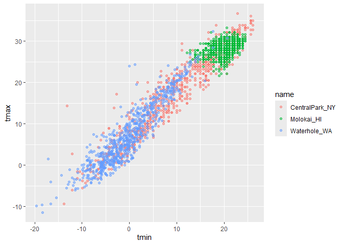
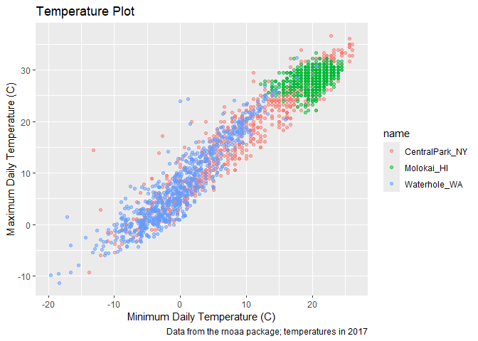

Visualization
================
Sarahy Martinez
2024-10-03

## Look at the weather data

``` r
library(tidyverse)
```

    ## ── Attaching core tidyverse packages ──────────────────────── tidyverse 2.0.0 ──
    ## ✔ dplyr     1.1.4     ✔ readr     2.1.5
    ## ✔ forcats   1.0.0     ✔ stringr   1.5.1
    ## ✔ ggplot2   3.5.1     ✔ tibble    3.2.1
    ## ✔ lubridate 1.9.3     ✔ tidyr     1.3.1
    ## ✔ purrr     1.0.2     
    ## ── Conflicts ────────────────────────────────────────── tidyverse_conflicts() ──
    ## ✖ dplyr::filter() masks stats::filter()
    ## ✖ dplyr::lag()    masks stats::lag()
    ## ℹ Use the conflicted package (<http://conflicted.r-lib.org/>) to force all conflicts to become errors

``` r
library(patchwork)
```

``` r
weather_df = 
  rnoaa::meteo_pull_monitors(
    c("USW00094728", "USW00022534", "USS0023B17S"),
    var = c("PRCP", "TMIN", "TMAX"), 
    date_min = "2021-01-01",
    date_max = "2022-12-31") |>
  mutate(
    name = case_match(
      id, 
      "USW00094728" ~ "CentralPark_NY", 
      "USW00022534" ~ "Molokai_HI",
      "USS0023B17S" ~ "Waterhole_WA"),
    tmin = tmin / 10,
    tmax = tmax / 10) |>
  select(name, id, everything())
```

    ## using cached file: C:\Users\sarah\AppData\Local/R/cache/R/rnoaa/noaa_ghcnd/USW00094728.dly

    ## date created (size, mb): 2024-09-26 23:39:45.766142 (8.668)

    ## file min/max dates: 1869-01-01 / 2024-09-30

    ## using cached file: C:\Users\sarah\AppData\Local/R/cache/R/rnoaa/noaa_ghcnd/USW00022534.dly

    ## date created (size, mb): 2024-09-26 23:40:09.008997 (3.94)

    ## file min/max dates: 1949-10-01 / 2024-09-30

    ## using cached file: C:\Users\sarah\AppData\Local/R/cache/R/rnoaa/noaa_ghcnd/USS0023B17S.dly

    ## date created (size, mb): 2024-09-26 23:40:17.640862 (1.038)

    ## file min/max dates: 1999-09-01 / 2024-09-30

## Remember this plot?

``` r
weather_df %>% 
  ggplot(aes(x = tmin, y = tmax)) + 
  geom_point(aes(color = name), alpha = .5)  #3 aesthetics defined  tmin, tmax, color 
```

    ## Warning: Removed 17 rows containing missing values or values outside the scale range
    ## (`geom_point()`).

<!-- -->

If this were a plot we wanted to share its sufficient but someone might
not know whats going on so we will add a text or label.

## Labels

``` r
weather_df %>% 
  ggplot(aes(x = tmin, y = tmax)) + 
  geom_point(aes(color = name), alpha = .5)+
  labs(
    title = "Temperature Plot",
    x = "Minimum Daily Temperature (C)",
    y = "Maximum Daily Temperature (C)",
    caption = " Data from the rnoaa package; temperatures in 2017"
  )
```

    ## Warning: Removed 17 rows containing missing values or values outside the scale range
    ## (`geom_point()`).

<!-- -->
